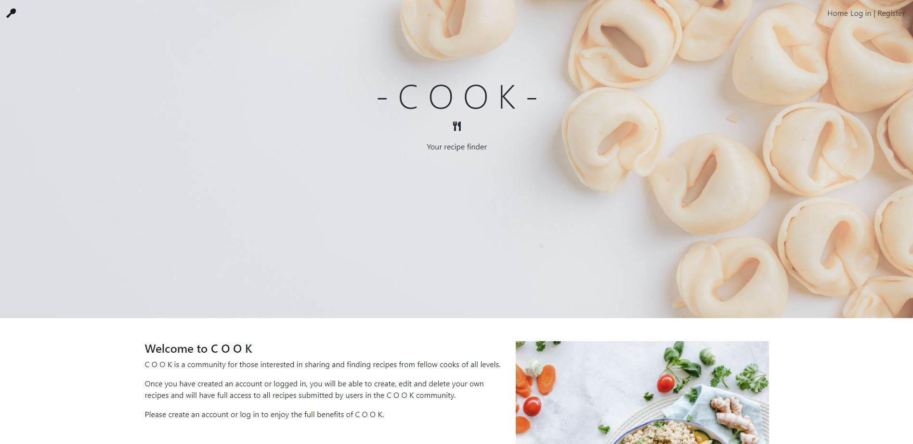

# C O O K

For this project, I have used HTML, CSS, Python(using Flask framework). The small amount of JavaScript has been handled by Bootstrap using a Jquery CDN. I have created the site to demonstrate CRUD capabilities of a MongoDB.

[Link to my deployed site on Heroku](https://cook-milestone3.herokuapp.com/)

---

# User Experience (UX)

The purpose of my site is almost like that of a personal recipe book. The user can create an account or log in(if they already have an account) and can add recipes which will be visible on the recipes page and their profile page. Users can view all recipes added to the database by other users or themselves. Users can edit or delete their own recipes but cannot make any changes to other's recipes.

## User Stories

## First Time Visitor Goals

- I want to understand the purpose of the site within a short time of visiting the site by the images and description on the landing page
- I want to easily create an account to make full use of the site
- I want to add, edit and delete my own recipes
- I want to view recipes submitted by other users
- I want to search the recipe database using keywords, recipe names and by course i.e. Breakfast, Lunch, Dinner

## Returning Time Visitor Goals & Frequent Time Visitor Goals

- I want to return to the site and log in
- I want to be able to view my recipes on my own profile page, separate to other user's recipes
- I want to easily add, edit and delete my own recipes
- I want to search the recipe database using keywords, recipe names and by course i.e. Breakfast, Lunch, Dinner

## Design

## Colour Scheme

- The colour scheme is white, grey and black
- Other colours are present through the use of photos on the site and a jumbotron image
- Links and buttons change colour when hovered over

## Typography

- Roboto from Google Fonts is the font used throughout the site

## Imagery

- I used Pexels to find images related to my site i.e. photos of food
- I have edited the photos on the site to appear lighter and not to detract away from the otherwise light-theme of the site

## Wireframes

- 

# Technologies Used

Languages used for this site:

- [JavaScript](https://www.javascript.com/)
- [HTML5](https://en.wikipedia.org/wiki/HTML5)
- [CSS3](https://en.wikipedia.org/wiki/Cascading_Style_Sheets)
- [Python](https://www.python.org/)
- [Bootstrap](https://getbootstrap.com/)
- [Flask](https://flask.palletsprojects.com/en/1.1.x/)
- [Jinja](https://jinja.palletsprojects.com/)

## Frameworks, Libraries & Programs Used

1. [Google Fonts:](https://fonts.google.com/)
   - Google fonts were used to import the Roboto font 
2. [Font Awesome:](https://fontawesome.com/)
   - Font Awesome was used for icons that appear on the site
3. [GitHub:](https://github.com/)
   - GitHub was used to store the project and version control
4. [Balsamiq:](https://balsamiq.com/)
   - Balsamiq was used to create the wireframes for the site
5. [Heroku:](https://www.heroku.com/)
   - Heroku was used to deploy the site
6. [MongoDB:](https://www.mongodb.com/cloud/atlas)
   - MongoDB used to store data in collections - user data and recipes

---

# Features

- A user can Create a recipes, a user can Read recipes, a user can Update and Delete recipes - CRUD functionality
- Defensive programming, 'required' attribute used to stop users being able to register a new user with blank spaced
- When editing a recipe, the input fields are pre-filled with data so a user does not have to re-type the entire recipe
- Min and Max length used for usernames and passwords and patterns used for further defensive programming
- Users can only edit and delete their own recipes, they cannot make any changes to other's recipes
- A user's profile displays their own recipes on their profile page
- Using Bootstrap and some media queries, the site is responsive on all device sizes

---

# Testing

## Code Validation

The W3C Markup Validator and W3C CSS Validator Services were used to validate every page of the project to ensure there were no syntax errors in the project and the Python code is PEP8 compliant.

### HTML

---

### CSS

---

### JavaScript

## Testing User Stories from User Experience (UX) Section

## First Time Visitor Goals

- As a first time user, 
-
-
-

## Returning Time Visitor Goals & Frequent Time Visitor Goals

-
-

## Further Testing

-
-
-
---

# Bugs/Known Issues

- I was unable to implement a modal for a user to confirm they wanted to delete a recipe before it was deleted, I was not able to get the delete button within the accordian to pull up the modal. As such, this feature was removed
- Using Bootstrap's 'select' input function, I was unable to make this field required so a user is able to create or edit a recipe without choosing a category
- 

# Resolved Issues

- When creating Procfile, I originally had typed 'web:python run.py' instead of 'web: python run.py'- this meant my Heroku app did not run and threw and Application Error, Cormac @ Code Institute spotted this and the issue resolved
- 
-

# Deployment

## Heroku

- Create Heroku app
- Connect Git remote
- Add requirements.txt(so Heroku knows what libraries we are using) and Procfile files(so Heroku knows we are running a Python app)

## GitHub 

GitHub repo was connected to my Heroku app, whenever any changes are pushed to GitHub they are automatically updated on Heroku so the Heroku app always reflects the most recent version of the site

---

# Credit

- [Pexels](https://www.pexels.com/) Stock images
- [Bootstrap Documentation](https://getbootstrap.com/docs/4.4/getting-started/introduction/)
- [Font Awesome](https://fontawesome.com/) for icons used on the site
- [Google Fonts](https://fonts.google.com/) Roboto font

---